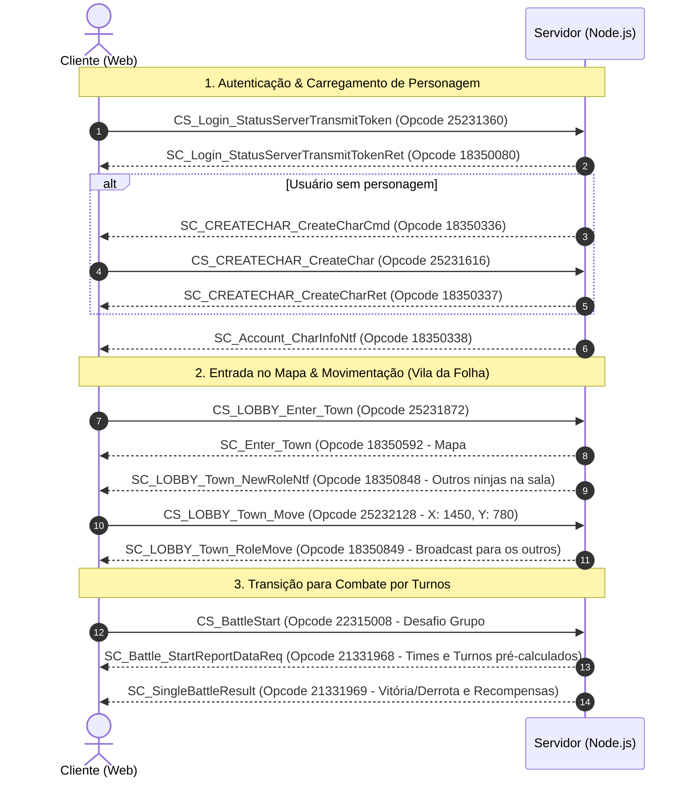

# Protocolo de Rede — Naruto Online

O protocolo de comunicação é binário puro, operando em **Modo Plano** (sem criptografia/cifra nos bytes do payload) empacotado em **Big Endian**.

---

## 1. Estrutura do Cabeçalho (Header: 8 Bytes)

Cada mensagem possui um cabeçalho fixo de 8 bytes antes do corpo da mensagem (Payload):

```text
 0                   1                   2                   3
 0 1 2 3 4 5 6 7 8 9 0 1 2 3 4 5 6 7 8 9 0 1 2 3 4 5 6 7 8 9 0 1
+-+-+-+-+-+-+-+-+-+-+-+-+-+-+-+-+-+-+-+-+-+-+-+-+-+-+-+-+-+-+-+-+
|                 PacketLength (uint32 BE, 4B)                  |
+-+-+-+-+-+-+-+-+-+-+-+-+-+-+-+-+-+-+-+-+-+-+-+-+-+-+-+-+-+-+-+-+
|                   PacketID (uint32 BE, 4B)                    |
+-+-+-+-+-+-+-+-+-+-+-+-+-+-+-+-+-+-+-+-+-+-+-+-+-+-+-+-+-+-+-+-+
|                    Payload Binário (N Bytes)                  |
|                              ...                              |
+-+-+-+-+-+-+-+-+-+-+-+-+-+-+-+-+-+-+-+-+-+-+-+-+-+-+-+-+-+-+-+-+
```

- **`PacketLength` (uint32 BE)**: Tamanho total do pacote em bytes, incluindo os 8 bytes do cabeçalho (`Length = 8 + Payload.length`).
- **`PacketID` (uint32 BE)**: Identificador do Opcode da ação/comando.
- **`Payload`**: Bytes de dados com os parâmetros da mensagem.

---

## 2. Tipos de Dados Primitivos

| Tipo | Tamanho | Formato | Observações |
| :--- | :--- | :--- | :--- |
| `Byte` / `UInt8` | 1 byte | Inteiro 0 a 255 | Gênero, direção, qualidade de item |
| `Short` / `Int16` | 2 bytes | Big Endian | Coordenadas $(X, Y)$, contadores pequenos |
| `UShort` / `UInt16` | 2 bytes | Big Endian | Portas de rede, contadores sem sinal |
| `Int` / `Int32` | 4 bytes | Big Endian | Níveis, moedas, IDs internos |
| `UInt` / `UInt32` | 4 bytes | Big Endian | Identificadores de Pacote, Roles, Skills |
| `Float` | 4 bytes | IEEE 754 BE | Vida atual, dano causado em combate |
| `Double` | 8 bytes | IEEE 754 BE | Valores de alta precisão |
| `FlushUTF` / `String` | 4B + N | uint32 BE + UTF-8 | String prefixada pelo número de bytes UTF-8 |

---

## 3. Fluxo Sequencial de Pacotes (Ciclo Principal de Vida)



---

## 4. Estrutura do Pacote de Combate (`SC_Battle_StartReportDataReq`)

O combate no cliente Flash é executado por reprodução de relatório sincronizado:

1. **`BattleIdStr`** (FlushUTF): Chave única da partida.
2. **`PlayerInfo_1` (Camp 0 - Aliados):**
   - Montaria, Formação de Almas, Anel, Emblema, `UserId`.
   - `FighterCount` (int16), seguido por cada ninja da equipe (Posição 1..15, HP, Fúria, Nível, Nome).
3. **`PlayerInfo_2` (Camp 1 - Inimigos):**
   - Mesma estrutura para a equipe adversária/monstros.
4. **`Turns` (Lista de Turnos):**
   - `TotalTurns` (int16).
   - Para cada turno: ações com camp/pos atacante, tipo de habilidade, alvos e dano causado (`HurtHp`).
